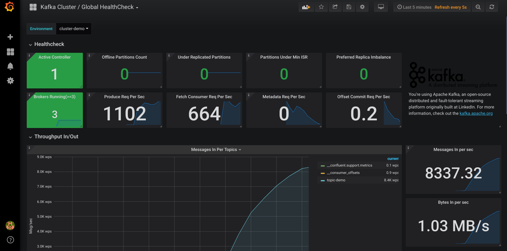
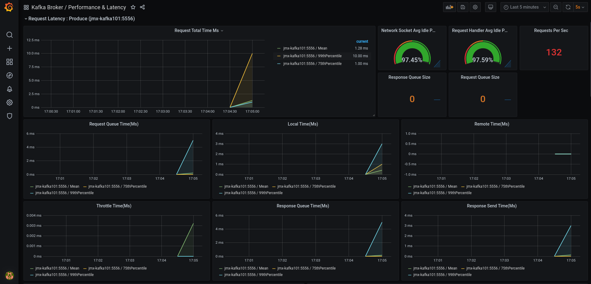
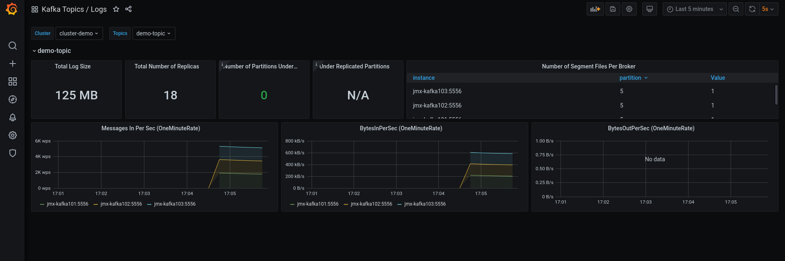

= Kafka Monitoring Stack for Docker Compose (Prometheus / Grafana)

image:https://img.shields.io/badge/License-Apache%202.0-blue.svg[https://github.com/streamthoughts/kafka-monitoring-stack-docker-compose/blob/master/LICENSE]
image:https://img.shields.io/github/issues-raw/streamthoughts/kafka-monitoring-stack-docker-compose[GitHub issues]
image:https://img.shields.io/github/stars/streamthoughts/kafka-monitoring-stack-docker-compose?style=social[GitHub Repo stars]

:toc:
:toc-placement!:

This repository demonstrates how to use Prometheus and Grafana for monitoring an Apache Kafka cluster.

toc::[]

== Stack

* Kafka (Confluent)
* Zookeeper
* Kafka Schema Registry (Confluent)
* KSQLDB
* Kafka Connect
* Prometheus
* Grafana
* AKHQ (https://akhq.io/)
* ZooNavigator (https://zoonavigator.elkozmon.com/en/stable/)

== Getting Started

**1. Clone the Kafka Monitoring Suite repository.**

[source,bash]
----
$ git clone https://github.com/streamthoughts/kafka-monitoring-stack-docker-compose.git
$ cd kafka-monitoring-stack-docker-compose
----

**2. Start Confluent/Kafka cluster.**

Deploy one of the provided docker-compose stack:

_Note: Depending on your network speed, this may take few minutes to download all images._

=== Single Zookeeper/Kafka with Prometheus/Grafana

Start/Stop with:

[source,bash]
----
$ ./single-node-stack-start.sh
$ ./single-node-stack-stop.sh

# or directly
$ docker-compose -f  zk-kafka-single-node-stack.yml up -d
$ docker-compose -f  zk-kafka-single-node-stack.yml down
----

=== Single Zookeeper / Multiple Kafka with Prometheus/Grafana

[source,bash]
----
$ docker-compose -f  zk-kafka-multiple-nodes-stack.yml up -d
$ docker-compose -f  zk-kafka-multiple-nodes-stack.yml down
----

=== Single Zookeeper/Kafka with Prometheus/Grafana (SASL/PLAINTEXT)

[source,bash]
----
$ ./sasl-single-node-stack-start.sh
$ ./sasl-single-node-stack-stop.sh
----

=== Single Zookeeper / Multiple Kafka with Prometheus/Grafana (SASL/PLAINTEXT)

[source,bash]
----
$ docker-compose -f  zk-kafka-multiple-nodes-secured-stack.yml up -d
$ docker-compose -f  zk-kafka-multiple-nodes-secured-stack.yml down
----

=== Full Stack (single node Kafka Cluster)

Start/Stop with:

[source,bash]
----
$ ./full-single-node-stack-start.sh
$ ./full-single-node-stack-stop.sh

# or directly
$ docker-compose -f  zk-kafka-single-node-full-stack.yml up -d
$ docker-compose -f  zk-kafka-single-node-full-stack.yml down
----

**3. Create Topic.**

Create `demo-topic` with 6 partitions and 3 replicas.

[source,bash]
----
$ docker exec -it kafka101 \
kafka-topics \
--create \
--partitions 6 \
--replication-factor 3 \
--topic demo-topic \
--bootstrap-server kafka101:29092
----

**4. Produce messages.**

Open a new terminal window, generate some message to simulate producer load.

[source,bash]
----
$ docker exec -it kafka101 \
kafka-producer-perf-test \
--throughput 500 \
--num-records 100000000 \
--topic demo-topic \
--record-size 100 \
--producer-props bootstrap.servers=kafka101:29092
----

**5. Consume messages.**

Open a new terminal window, generate some message to simulate consumer load.

[source,bash]
----
$ docker exec -it kafka101 \
kafka-consumer-perf-test \
--messages 100000000 \
--timeout 1000000 \
--topic demo-topic \
--reporting-interval 1000 \
--show-detailed-stats \
--bootstrap-server kafka101:29092
----

**6. Open Grafana.**

Open your favorite web browser and open one of the provided Grafana dashboards :

* Kafka Cluster / Global Health Check

* Kafka Cluster / Performance

* Kafka Cluster / Zookeeper Connections
* Kafka Cluster / JVM & OS
* Kafka Cluster / Hard disk usage
* Kafka Cluster / Topic Logs

=== Accessing Grafana Web UI

Grafana is accessible at the address : http://localhost:3000

Security are :

* user : `admin`
* password : `kafka`

=== Accessing Prometheus Web UI

Prometheus is accessible at the address : http://localhost:9090

== Contributions

Any feedback, bug reports and PRs are greatly appreciated!

== Licence

Copyright 2020 StreamThoughts.

Licensed to the Apache Software Foundation (ASF) under one or more contributor license agreements. See the NOTICE file distributed with this work for additional information regarding copyright ownership. The ASF licenses this file to you under the Apache License, Version 2.0 (the "License"); you may not use this file except in compliance with the License. You may obtain a copy of the License at

http://www.apache.org/licenses/LICENSE-2.0["http://www.apache.org/licenses/LICENSE-2.0"]

Unless required by applicable law or agreed to in writing, software distributed under the License is distributed on an "AS IS" BASIS, WITHOUT WARRANTIES OR CONDITIONS OF ANY KIND, either express or implied. See the License for the specific language governing permissions and limitations under the License
